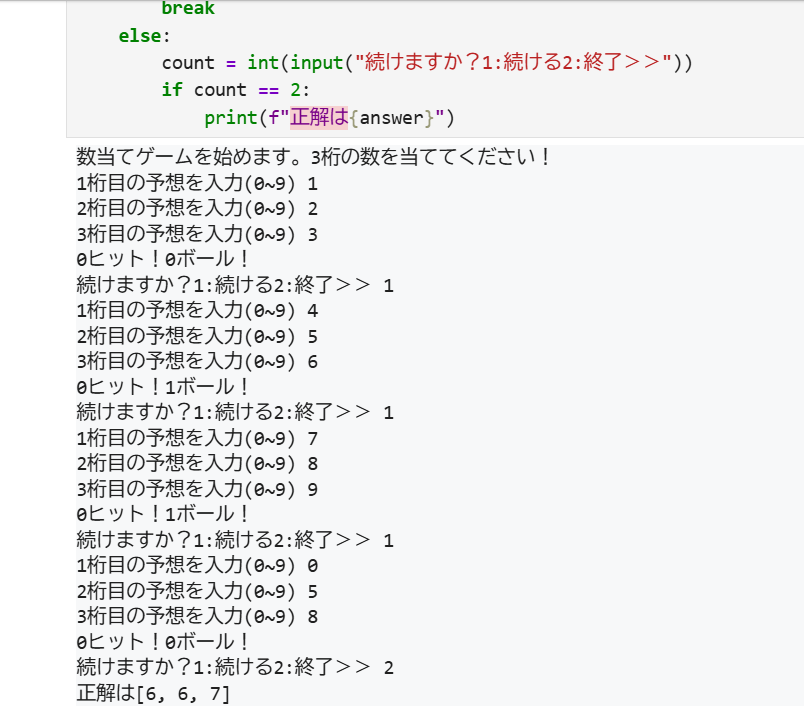

# number_guessing_game
# Revision 2 (2025/11/01): Refactored based on feedback from Qiita
Based on valuable feedback from the Qiita community, this project has been refactored. 

・Replaced for loops with list comprehensions to improve readability. 

・Refactored the comp() function to use a more efficient logic with zip() and sum().

・Corrected a logic bug in the Hit/Blow calculation.
## Overview
I made this game from "スッキリわかるpython入門".
You can type each number to guess three numbers PC thought.

## How to Run
To run this game, execute the following command in your terminal:
```python
hit_and_blow.ipynb
```
## Execution Proof

