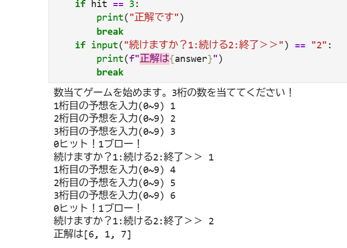

# number_guessing_game
## Overview
I made this game from "スッキリわかるpython入門".
You can type each number to guess three numbers PC thought.

## How to Run
To run this game, execute the following command in your terminal:
```python
hit_and_blow.ipynb
```
## Execution Proof

